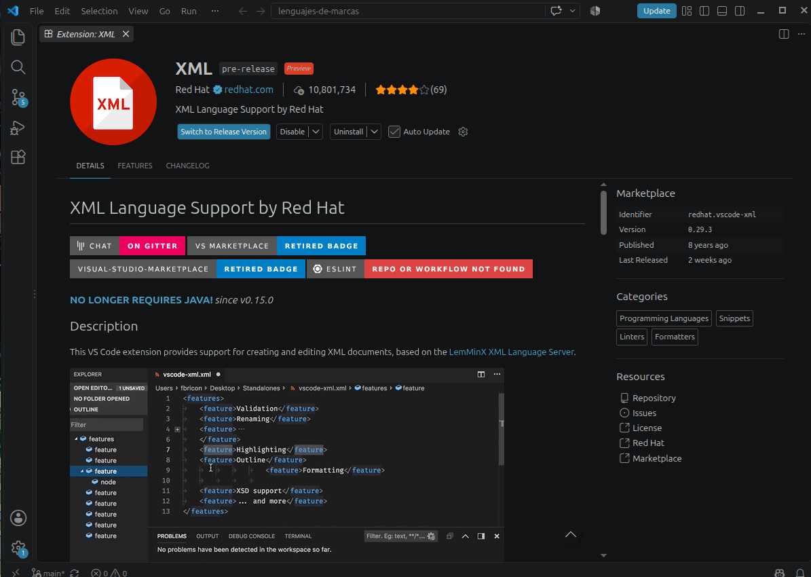
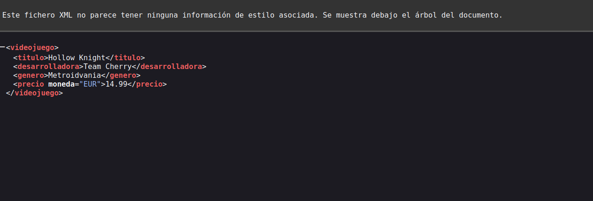
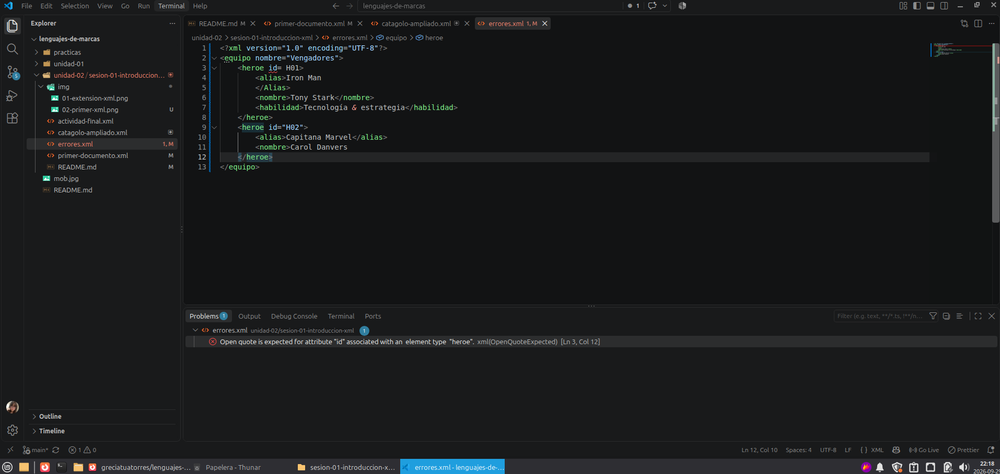
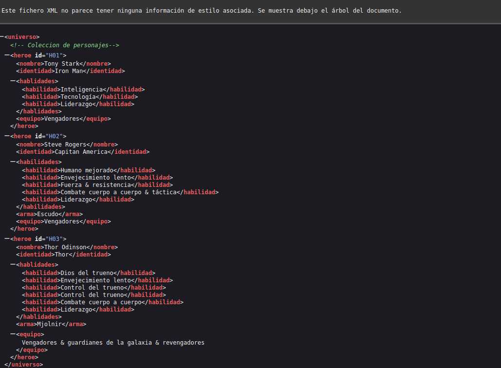

# Sesión 1. Introducción práctica a XML

## 1. Preparación del entorno

He instalado la extensión XML de Red Hat en Visual Studio Code para facilitar la escritura y detección de errores en los documento XML

---

## 2. Investigación inicial

1. **¿Qué significa XML?**

XML significa eXtensible Markup Language, que en español es Lenguaje de Marcado Extensible.

2. **¿Porque es extendible?**

Porque podemos crear nuestras propias etiquetas según la información que queramos guardar. Por ejemplo, <videojuego>, <titulo> o <precio>.

3. **¿Qué diferencia hay entre XML y HTML?**

HTML se utiliza principalmente para estructurar el contenido de las páginas web. XML se utiliza para representar, organizar y transportar datos mediante etiquetas que podemos definir nosotros.

- **Tres usos reales del XML**

- Intercambiar datos entre aplicaciones.

- Guardar configuraciones de programas.

- Representar información en documentos y formatos especializados.

4. **¿Qué significa que sea legible para personas y máquinas?**

Que una persona puede leer las etiquetas y entender los datos, mientras que un programa puede interpretar su estructura y procesar esa información.

5. **¿Porque no es automaticamente una base de datos?**

Porque XML es un formato para representar información. Aunque puede almacenar datos en un archivo, no es por sí mismo un sistema gestor de bases de datos.

---

## 3. Mi primer documento XML

- **Elemento Raíz:**
  videojuego

- **Elementos:**
  videojuego, titulo, precio, desarrolladora, genero

- **Atributo:**
  moneda, cuyo valor es EUR

- **Relación entre videojuego y titulo:**
  videojuego es el padre y titulo es el hijo

- **Elementos hermanos:**
  titulo, precio, desarrolladora y genero

---

## 4. Ampliación del catalogo

<?xml version="1.0" encoding="UTF-8"?>
<catalogo>
    <videojuego id="V001" disponible="true">
        <titulo>Hollow Knight</titulo>
        <desarrolladora>Team Cherry</desarrolladora>
        <genero>Metroidvania</genero>
        <precio moneda="EUR">14.99</precio>
    </videojuego>

    <videojuego id="V002" disponible="true">
        <titulo>Zenless Zone Zero</titulo>
        <desarrolladora>Hoyoverso</desarrolladora>
        <plataformas>
            <plataforma>PC</plataforma>
            <plataforma>Play Station</plataforma>
        </plataformas>
        <precio moneda="EUR">00.00 </precio>
    </videojuego>

    <!-- Tercer videojuego del catalogo-->

    <videojuego id="V003" disponible="true">
        <titulo>Honkai Rail</titulo>
        <desarrolladora>Hoyoverso</desarrolladora>
        <plataformas>
            <plataforma>PC</plataforma>
            <plataforma>Play Station</plataforma>
        </plataformas>
        <precio moneda="EUR">00.00 </precio>
    </videojuego>

    <videojuego id="V004" disponible="true">
        <titulo>Minecraft</titulo>
        <desarrolladora>Mojang Studios</desarrolladora>
        <plataformas>
            <plataforma>PC</plataforma>
            <plataforma>Play Station</plataforma>
            <plataforma>Xbox</plataforma>
            <plataforma>Nintendo Switch</plataforma>
        </plataformas>
        <precio moneda="EUR">29,99</precio>
    </videojuego>

    <videojuego id="V005" disponible="true">
        <titulo>My pet Femboy</titulo>
        <desarrolladora>FzzyBzzy</desarrolladora>
        <plataformas>
            <plataforma>PC</plataforma>
        </plataformas>
        <precio moneda="EUR">3,15</precio>
    </videojuego>

    <videojuego id="V006" disponible="true">
        <titulo>Elden Ring</titulo>
        <desarrolladora>FromSoftware</desarrolladora>
        <plataformas>
            <plataforma>PC</plataforma>
            <plataforma>Play Station</plataforma>
            <plataforma>Nintendo Switch</plataforma>
            <plataforma>Xbox</plataforma>
        </plataformas>
        <precio moneda="EUR">69.00</precio>
    </videojuego>

    <videojuego id="V007" disponible="true">
        <titulo>Wuthering Waves </titulo>
        <desarrolladora>KURO GAMES</desarrolladora>
        <plataformas>
            <plataforma>PC</plataforma>
            <plataforma>Play Station</plataforma>
            <plataforma>Xbox</plataforma>
        </plataformas>
        <precio moneda="EUR">00.00 </precio>
    </videojuego>

    <videojuego id="V008" disponible="true">
        <titulo>Resident Evil</titulo>
        <desarrolladora>CONCAP</desarrolladora>
        <plataformas>
            <plataforma>PC</plataforma>
            <plataforma>Play Station</plataforma>
            <plataforma>Xbox</plataforma>
        </plataformas>
        <precio moneda="EUR">20.00</precio>
    </videojuego>

    <videojuego id="V009" disponible="true">
        <titulo>Fortnite</titulo>
        <desarrolladora>Epic Games</desarrolladora>
        <plataformas>
            <plataforma>PC</plataforma>
            <plataforma>Play Station</plataforma>
        </plataformas>
        <precio moneda="EUR">00.00 </precio>
    </videojuego>

    <videojuego id="V0010" disponible="true">
        <titulo>Dispatch</titulo>
        <desarrolladora>AdHoc Studio</desarrolladora>
        <plataformas>
            <plataforma>PC</plataforma>
            <plataforma>Play Station</plataforma>
        </plataformas>
        <precio moneda="EUR">38.99</precio>
    </videojuego>

</catalogo>

- **Catalogo es la raíz y contiene los videojuegos.**

- **Videojuego es un registro individual.**

- **Id identifica cada videojuego. No se repite**.

- **Plataformas es un contenedor: agrupa las plataformas de ese juego.**

- **Plataforma se repite porque un videojuego puede estar disponible en varios sistemas.**

---

## 5. Laboratorio de errores

|

| Error Detectado        | Regla que incumple                       | Correcciones           |
| ---------------------- | ---------------------------------------- | ---------------------- |
| Atributo sin comilla   | los valores deben ir entre comillas      | Añadi las comillas     |
| Etiqueta con mayuscula | la apertura y cierre deben coincidir     | Cambie Alias por alias |
| Simbolo &              | Debe ponerse como & amp; (todo va junto) | Sustitui el simbolo    |
| Etiqueta sin cerrar    | Todos los elementos deben cerrarse       | Añadi</> a nombre      |

---

## 6. Actividad final independiente

## **Diseño**

| Dato          | Elemento atributo                     | Justificación                                     |
| ------------- | ------------------------------------- | ------------------------------------------------- |
| Identificador | Atributo **id**                       | Permite distinguir a cada heroe                   |
| Habilidades   | Elementos **habilidad y habilidades** | Permiten agrupar varias habilidades por personaje |
| Arma          | Elemento **arma**                     | Representa algunas armas de los heroes (opcional) |

## **Elemento opcional**

El elemento **arma** solo es opcional porque lo tiene steve y thor

## Resumen

- **Regitros principales:** 3 Heroes

- **Nombres de elementos diferentes:** 8 elemetos distintos si contamos el elemento **arma** (universo, heroe, nombre, identidad, habilidad, habilidades, equipo y arma)

- **Atributos:** 3 atributos id por cada heroe

- **Coleccion repetidad:** 14 elementos habilidad

